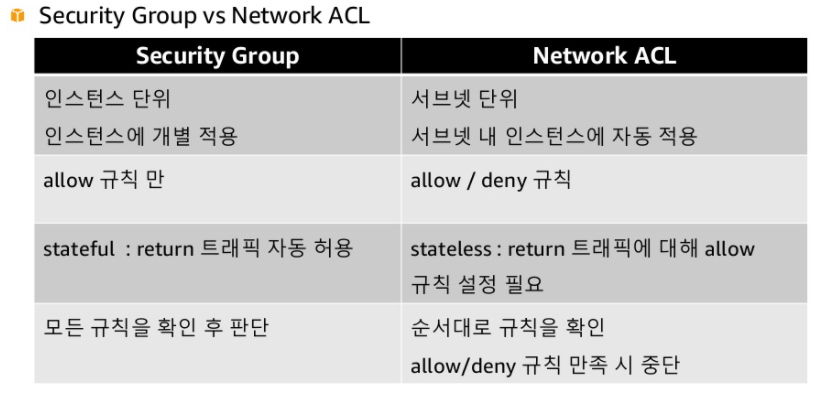
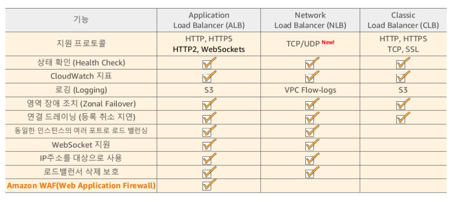
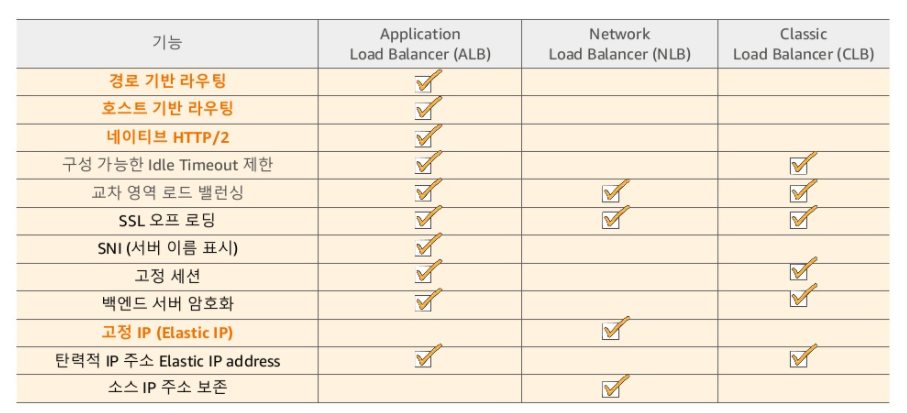

### vpc 만들기: IP 결정 시 고려 사항

#### Private IP 표준 권장

-10.0.0.0/8

-172.16.0.0/12

-192.168.0.0/16

#### 예약된 IP 주소 총 5개

-10.0.0.0: 네트워크 주소

-10.0.0.2: AWS에서 예약한 DNS 주소

-10.0.0.3: AWS 에서 향후 사용을 위하여 예약

-10.0.0.255: 브로드캐스트 주소=> VPC 에서는 브로드캐스트 지원 X, AWS 예약

#### Internet Gateway

인터넷 구간과 연결하려는 ec2인스턴스는 Public IP나 EIP 를 가져야 한다

Public subnet 은 IG Attached & Routing Table 수정

#### NAT Gateway

AWS가 제공하는 완전 관리형 서비스

Private subnet에 있는 인스턴스들이 외부와 통신할 떄 사용

NAT Gateway당 하나의 EIP 필요

#### VPC Peering

2개의 VPC 간 네트워크 연결

서로 다른 리전의 VPC 간 Peering 가능

단 VPC CIDR 범위는 서로 겹치치 않아야 함

VPC Peering 생성 시 Route 수정 필요

#### Elastic Load Balancer

리전 내 로드 밸런싱 서비스 

다수의 AZ의 Target 에 트래픽 분산

